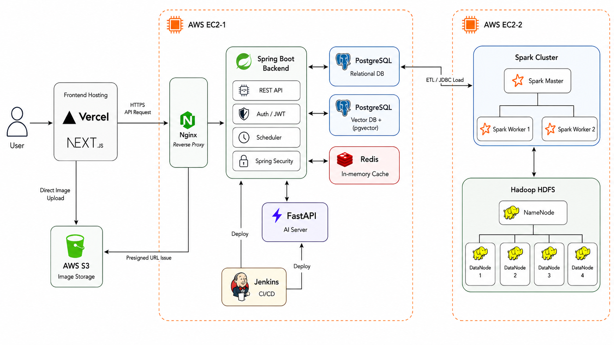

# 🏠 방방곡곡

### 빅데이터 기반 AI 매물 추천 및 지역 인프라 탐색 서비스

## 1. 프로젝트 소개

**빅데이터**와 **AI**를 활용해, 타지에서 자취를 준비하는 **청년·사회초년생**이 전월세 매물을 고를 때 겪는 시세 판단, 안전도, 생활 인프라, 통근 시간 문제를 기반으로 **맞춤형 매물과 지역 정보를 추천·탐색하는 서비스**입니다.

 

## 2. 주요 핵심 기능

### 1. 사용자 맞춤 지역구 및 실매물 추천
- 사용자의 예산, 선호 인프라, 통근 조건을 기반으로 적합한 지역구와 전월세 실매물을 추천합니다.
- 지역별 시세, 안전도, 생활 인프라, 통근 접근성 지표를 종합해 사용자의 조건에 맞는 후보 지역을 제공합니다.
- 추천된 지역 내에서 조건에 부합하는 실매물을 함께 제안하여 탐색 범위를 줄입니다.

### 2. 지도 기반 실매물 탐색 및 정보 조회
- 지도에서 매물을 선택하면 해당 매물의 위치를 기준으로 주변 생활 인프라 정보를 제공합니다.
- 반경 내 편의점, 약국, 병원, 지하철역, 버스정류장 등 주요 시설 정보를 조회할 수 있습니다.
- PostGIS 기반 공간 조회를 활용해 매물 주변 인프라를 빠르게 탐색할 수 있도록 구성했습니다.

### 3. 매물 실거래 데이터 기반 통계 대시보드
- 지역별 전월세 실거래 데이터를 기반으로 평균 보증금, 평균 월세, 거래 추이 등의 통계 정보를 제공합니다.
- 사용자가 현재 보고 있는 매물이 지역 시세 대비 적정한지 판단할 수 있도록 비교 기준을 제공합니다.
- 월별 추이와 지역 단위 통계를 통해 가격 변동 흐름을 확인할 수 있습니다.

### 4. 텍스트 기반 AI 매물 추천
- 사용자가 자연어로 입력한 조건을 기반으로 적합한 지역과 매물 정보를 추천합니다.
- 예산, 교통, 안전, 생활 인프라 등 여러 조건을 기반으로 추천 후보를 생성합니다.
- 추천 결과와 함께 추천 이유를 제공하여 사용자가 결과를 이해할 수 있도록 했습니다.

### 5. 찜한 실매물 비교
- 사용자가 관심 있는 매물을 찜 목록에 저장하고 여러 매물을 한 번에 비교할 수 있습니다.
- 보증금, 월세, 관리비, 면적, 위치, 주변 인프라, 통근 조건을 기준으로 비교합니다.
- 후보 매물 간 장단점을 정리해 최종 의사결정을 돕습니다.

 

## 3. 시스템 아키텍처

> 시스템 아키텍처 이미지는 추가 예정.

- Spring Boot 서버는 사용자 요청, 인증, 매물/지역/인프라 조회 API를 담당합니다.
- FastAPI 서버는 AI 기반 매물 추천 및 자연어 조건 처리를 담당합니다.
- Hadoop/Spark는 공공데이터 정제·집계 파이프라인을 담당합니다.
- PostgreSQL/PostGIS는 매물, 지역, 공간 데이터를 저장하고 위치 기반 조회를 처리합니다.
- Redis는 캐싱 및 빠른 조회가 필요한 데이터 처리에 활용합니다.

 

## 4. 기술 스택
#### Frontend

 

 

#### Backend & AI

#### DB

#### Data Engineering

#### Infra

 

## 5. 활용 데이터셋

| 분류 | 데이터셋 | 활용 목적 |
|---|---|---|
| 실거래가 | 국토교통부_단독/다가구 전월세 실거래가 자료 | 지역별 전월세 시세 분석, 평균 보증금/월세 산출, 매물 가격 비교 기준 생성 |
| 실거래가 | 국토교통부_오피스텔 전월세 실거래가 자료 | 오피스텔 전월세 시세 분석 및 지역별 주거 비용 통계 생성 |
| 지역 코드 | 행정표준코드관리시스템_법정동코드 | 실거래가, 인프라, 안전 데이터를 동일한 지역 기준으로 매핑하기 위한 기준 코드로 활용 |
| 상권/생활 | 소상공인시장진흥공단_상가(상권)정보 | 편의점, 약국, 음식점, 카페 등 생활 인프라 분석 및 매물 주변 시설 조회에 활용 |
| 교통 | ODsay LAB | 매물 위치 기준 대중교통 통근/통학 시간 계산에 활용 |
| 교통 | 서울시 버스정류소 위치정보 | 매물 주변 버스정류장 접근성 분석 및 지도 기반 인프라 조회에 활용 |
| 교통 | 서울시 역사마스터 정보 | 매물 주변 지하철역 접근성 분석 및 교통 인프라 조회에 활용 |
| 안전 | 생활안전지도 API_CCTV | 지역별 CCTV 수 집계 및 안전 지표 산출에 활용 |
| 안전 | 생활안전지도 API_치안 | 지역별 치안 관련 지표 산출 및 안전도 판단 기준으로 활용 |
| 안전 | 여성밤길안전 구역 Json | 매물 주변 안전 관련 구역 정보 제공 및 안전 지표 보조 데이터로 활용 |
| 안전 | 서울시 보행등 위도 경도 현황 | 야간 보행 환경 및 안전 인프라 분석에 활용 |

### 데이터 처리 기준

- 공공데이터는 Hadoop HDFS에 원천 데이터를 적재한 뒤, Spark를 통해 정제·집계하여 PostgreSQL에 적재했습니다.
- 지역 단위 통계는 법정동 코드를 기준으로 매핑하여 데이터 간 기준을 통일했습니다.
- 위치 기반 데이터는 위도·경도 좌표를 PostGIS `geometry(Point, 4326)` 형태로 저장하여 반경 기반 조회에 활용했습니다.

 

## 6. 기술적 의사결정
#### 1. 공간 데이터 조회 성능 개선
- PostGIS `ST_DWithin`을 활용해 매물 반경 내 인프라 조회 API 구현
- `location::geography` 기반 GiST 인덱스 적용
- 상권 카테고리 조회를 위한 BTREE 인덱스 적용
- EXPLAIN ANALYZE를 통해 쿼리 실행 계획 확인

#### 2. Spark 기반 공공데이터 ETL
- 원천 CSV 데이터를 HDFS raw 영역에 적재
- Spark로 정제/집계 후 PostgreSQL mart 테이블에 적재
- 법정동 코드 기준으로 지역 통계 데이터 매핑

#### 3. AI 추천 서버 분리
- Spring Boot 메인 서버와 FastAPI AI 서버를 분리
- 추천/검색 로직을 별도 서버에서 처리하여 역할 분리

 

## 7. 팀 구성 및 담당 역할

<table align="center" style="width:1000px" cellpadding="0" cellspacing="0" border="0">
  <colgroup>
    <col style="width:50%" />
    <col style="width:50%" />
  </colgroup>

  <!-- ================= Backend ================= -->
  <tr>
    <td colspan="2" align="center">
      <b>Backend</b>
    </td>
  </tr>

  <tr>
    <td align="center"><b>윤정아 (팀장 · BE · Infra)</b></td>
    <td align="center"><b>김희원 (BE)</b></td>
  </tr>

  <tr>
    <td align="center">
      
    </td>
    <td align="center">
      
    </td>
  </tr>

  <tr>
    <td align="center">
      Docker 기반 Hadoop/HDFS + Spark 환경 구축 
      Spark 기반 공공데이터 ETL 및 파이프라인 구현 
      지역구 Top3 추천 로직 구현 
      PostGIS 기반 매물 주변 인프라 위치 조회 구현 
    </td>
    <td align="center">
      실매물 Top10 추천 알고리즘 구현 
      Odsay API 기반 매물 통근 시간 기능 구현 
      Spark 기반 과거 매물 시세 조회 구현  
    </td>
  </tr>

  <tr><td colspan="2" height="24"></td></tr>

  <tr>
    <td align="center"><b>유규봉 (BE · Infra)</b></td>
    <td align="center"><b>이서영 (BE)</b></td>
  </tr>

  <tr>
    <td align="center">
      
    </td>
    <td align="center">
      
    </td>
  </tr>

  <tr>
    <td align="center">
      Docker/Jenkins 기반 CI/CD 파이프라인 구축 
      Cross-Encoder Reranker 기반 AI 매물 추천 구현 
      AI 기반 사용자 맞춤형 매물 비교 기능 구현 
      OAuth 2.0 연동 및 매물 니즈 관리 API 구현
    </td>
    <td align="center">
      AI 매물 추천 RAG 파이프라인 설계 
      AI 매물 추천이유 생성 
      부동산 매물 CRUD 구현 
      GeoCoding 생성
    </td>
  </tr>

  <!-- ================= Frontend ================= -->
  <tr><td colspan="2" height="40"></td></tr>

  <tr>
    <td colspan="2" align="center">
      <b>Frontend</b>
    </td>
  </tr>

  <tr>
    <td align="center"><b>김희수 (FE)</b></td>
    <td align="center"><b>유주성 (FE)</b></td>
  </tr>

  <tr>
    <td align="center">
      
    </td>
    <td align="center">
      
    </td>
  </tr>

  <tr>
    <td align="center">
      동네·매물 추천 UI 구현 
      Recharts 기반 지역 통계 시각화 구현 
      마이페이지 UI 구현
    </td>
    <td align="center">
      홈페이지 UI 구현 
      AI 매물 검색·비교 UI 구현 
      Kakao Map API 기반 지도 기능 구현 
      프론트엔드 전체 API 연동 및 데이터 연결
    </td>
  </tr>
</table>
